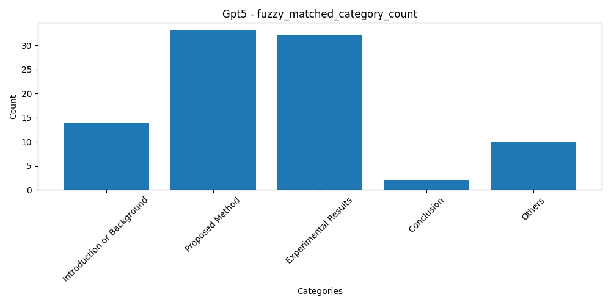

# sample_data/latex_paper

- `parse_result/`  
  Extracted images and metadata from `*.pdf`.

- `merged.tex`  
  A single LaTeX file produced by merging all `.tex` files in the path.

- `output.txt`  
  Preprocessed plain text used to generate QA.

- `prompt_response.json`  
  Raw LLM output.

- `processed_response.json`  
  Parsed QA pairs extracted from `prompt_response.json`.


# Preprocessing

pre_tex_pipeline.py

1) Merge and clean
- Merge all `.tex` files into `merged.tex`.
- Remove LaTeX comments: anything after `%` to end of line.

2) References
- Convert `\ref{fig:xxx}` → `[Ref id="fig:xxx"]` (no space after the colon).

3) Tables
- Add `[Table]` at the beginning of each table block.
- Keep only the header row as `[TableHeader] ...`.
- Convert `\caption{...}` → `[Caption] ...`.
- Convert `\label{tab:xxx}` → `[Label id="tab:xxx"]`.
- Drop the table body content.

4) Images
- Convert `\includegraphics{figure/xxx.pdf}` → `[Graphic src="figure/xxx.pdf"]`.
- Convert `\caption{...}` → `[Caption] ...`.
- Convert `\label{fig:xxx}` → `[Label id="fig:xxx"]`.


### Minimal Before/After Example

Input (LaTeX):

```
\section{Related Work}
As shown in Figure~\ref{fig:arch}.

\begin{figure}
\includegraphics{figure/arch.pdf}
\caption{Overall framework}
\label{fig:arch}
\end{figure}

\begin{table}
\caption{Dataset statistics}
\label{tab:stats}
\begin{tabular}{lcc}
Method & Acc & F1 \\
A & 90 & 88 \\
B & 92 & 90 \\
\end{tabular}
\end{table}
```

Output (preprocessed):

```
§ RELATED WORK §
As shown in Figure~[Ref id="fig:arch"].
[Graphic src="figure/arch.pdf"]
[Caption] Overall framework
[Label id="fig:arch"]

[Table]
[Caption] Dataset statistics
[Label id="tab:stats"]
[TableHeader] Method | Acc | F1
```


# Analysis

Rouge_L_evidence2.py

## ROUGE-L score calculation

Goal: For each evidence section, compare its content with the matched original document section and compute ROUGE-L.

Split original document (`Stage1_code/tex_analysis.py`)
- Input: `merged.tex`
- Output: a mapping `{section_title: content}`

```python

from rouge_score import rouge_scorer

_SCORER.score(target=evidence_content_piece, prediction=gold_content)['rougeL'].recall
```

## Section Categorization (Fuzzy Matching)

Target categories:
1. Introduction or Background
2. Proposed Method
3. Experimental Results
4. Conclusion
5. Others

Anchors:
```python
from rapidfuzz import fuzz

ANCHOR_SECTIONS = {
    "intro_background": ["abstract", "introduction", "related work", "background", "preliminaries", "literature review"],
    "experiments": ["experiment", "evaluation", "results", "analysis", "experiment & analysis"],
    "conclusion": ["conclusion", "discussion", "summary", "closing remarks", "limitations"],
}

fuzzy_score = fuzz.partial_ratio(section_name, anchor)
```

Algorithm:
- Step 1: Fuzzy-match section titles to locate three boundaries: end of Introduction/Background (`intro_end`), start of Experiments (`exp_start`), and start of Conclusion (`concl_start`).
- Step 2: For each section `i` in document order, assign:
  - `i <= intro_end`: Intro/Background (ignored)
  - `intro_end < i < exp_start`: Proposed Method (target)
  - `i >= exp_start` and before Conclusion anchors: Experiments (ignored)
  - `i >= concl_start`: Conclusion (ignored)
  - Otherwise: Others (target)


## Metrics to Report
- Category counts for target categories (Introduction/Background, Proposed Method, Others...).
- Misclassification count: number of sections where predicted category ≠ true category.
- ROUGE-L < 0.95 count: number of evidences with score below 0.95.
- Intent distribution counts.
- Evidence length stats per question: max/min average length.
- Evidence count stats per question: max/min/avg number of evidences.


## Output File Format

```json
[
  {
    "question": "Summarize the full ChuLo pipeline: ...",
    "intent": ["Descriptive", "Procedural"],
    "num_sections": 2,
    "avg_evidence_len": 743.5,
    "evidences": [
      {
        "section_name": "related work",
        "fuzzy_matched_section": "related work",
        "true_category": "Introduction or background",
        "content": "The Overall ChuLo Framework proposed ...",
        "gold_paragraph": "§ RELATED WORK §. § ...",
        "max_rougeL_score": 1.0,
        "evidence_length": 144
      }
    ]
  }
]
```

Field notes for per question:
- `intent`: list of intent labels for the question.
- `num_sections`: number of distinct original document sections used.
- `avg_evidence_len`: average token length of evidences.
- `evidence_length`: token length of an individual evidence.
- `max_rougeL_score`: ROUGE-L recall between evidence and matched gold section.
- `true_category`: fuzzy matched category for the matched section.


## Analysis result demo

Below are sample plots generated by `Stage1_code/Rouge_L_evidence2.py` and saved in `plots/`.

Summary table (3 models)


True category counts




Intent distribution


Box plots


